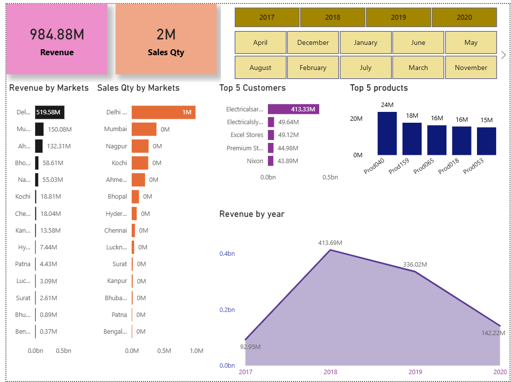

# 📊 Sales Insights Dashboard | Power BI

## Overview

This repository contains a Power BI Sales Insights Dashboard created as a guided learning project by following the Codebasics YouTube tutorial.

The objective of this project was to understand the complete data analysis workflow, including data discovery, ETL, data modeling, DAX, and dashboard development using Power BI.

> **Project Type:** Guided Learning Project

---

## Dashboard Preview



---

## Tools & Technologies

- Power BI Desktop
- Power Query
- DAX
- MySQL
- Data Modeling
- Data Visualization

---

## Skills Demonstrated

- Data Cleaning & Transformation
- Data Modeling
- Creating Relationships
- DAX Measures
- KPI Cards
- Interactive Dashboard Design
- Business Insights Reporting

---

## Key Insights

- Revenue and Sales Performance
- Market-wise Revenue Analysis
- Customer Performance
- Product Performance
- Profit Trends
- Interactive Filtering using Slicers

---

## Repository Contents

```
├── Sales Insight.pbix
├── Dashboard.png
├── README.md
```

---

## Learning Outcome

Through this project, I learned how to:

- Import and transform data
- Build a star schema
- Create DAX measures
- Design interactive dashboards
- Present business insights effectively

---

## Credits

This dashboard was created as a guided learning project by following the Codebasics Power BI tutorial.

Tutorial: https://youtu.be/hhZ62IlTxYs

The project is shared for educational and portfolio purposes only.

---

## Connect with Me

**Harshitha P**

LinkedIn: https://www.linkedin.com/in/harshitha-p-a27616370

GitHub: https://github.com/harshithakulal76-star
